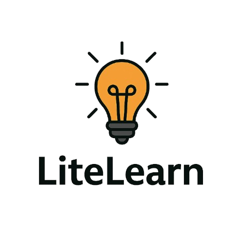

# LiteLearn  
*Learn anytime, anywhere — even offline*  

🔗 [Live Demo](https://SartajVirdi.github.io/LiteLearn) 

<p align="left">
  
</p>

**Created by:** Sartaj Virdi  
**Hackathon Submission — August 2025**  

---

## Project Overview  
Millions of learners face barriers such as unreliable internet, lack of localized content, and low digital literacy.  
LiteLearn bridges this gap with a lightweight, offline-first Progressive Web App (PWA) that delivers bilingual, accessible learning content for under-resourced communities.  

---

## Setup & Deployment  

### Prerequisites
- Node.js (v16 or later recommended)  
- npm or yarn installed  

### Run Locally
```bash
git clone https://github.com/SartajVirdi/LiteLearn.git
cd LiteLearn
npm install
npm start
```
This runs the app at http://localhost:3000/.
### Build for Production
```bash
npm run build
```
### Deploy to GitHub Pages
```bash
npm run deploy
```

---

## Demonstration  
1. Launch LiteLearn – Homepage with logo, language switch, offline badge  
2. Open a Lesson – Lesson content with Text-to-Speech  
3. Test Yourself Quiz – Adaptive spaced repetition in action  
4. Teacher Mode – Upload CSV or Try Demo CSV for instant lessons  
5. Go Offline – Lessons and progress still work  
6. Install Prompt – Install LiteLearn as a PWA  

---

## Key Features  
- **Offline-First PWA** – Lessons, progress, and teacher-imported content work without internet.  
- **Bilingual Support (English & Hindi)** – Instant toggle between languages.  
- **Teacher Mode (CSV Import)** – Upload CSV files to generate custom lessons.  
- **Interactive Learning** – Each lesson has a *Test Yourself* quiz with adaptive spaced repetition.  
- **Accessibility by Design**:  
  - Text-to-Speech (TTS) for low-literacy learners.  
  - High-contrast mode for visually impaired users.  
  - Skip-to-content navigation and focus rings for screen readers.  
- **Installable** – Functions like a native app on mobile and desktop.  

---

## Technical Implementation  

### Tech Stack  
- Frontend: React + React Router  
- PWA Support: Service Worker + Web App Manifest  
- Storage: LocalStorage (progress, imported lessons)  
- CSV Parsing: PapaParse  
- Deployment: GitHub Pages  

### Architecture (Important Files)  
- **App.js** – Main app entry (routes, header, footer)  
- **components/**  
  - `LessonList.js` – Shows all lessons, tracks status (Completed/Later)  
  - `LessonView.js` – Lesson content, TTS, quiz  
  - `TeacherImport.js` – Upload CSV → new lessons generated  
  - `OfflineBadge.js` – Online/offline status indicator  
  - `LanguageSwitch.js` – Toggle English/Hindi  
  - `HighContrastToggle.js` – Accessibility toggle  
  - `SkipToContent.js` – Screen reader / keyboard navigation  
  - `ClearImportedLessons.js`, `ResetProgress.js` – Utility actions  
- **adapt.js** – Spaced repetition (dueNow, updateMastery)  
- **progress.js** – LocalStorage progress tracking  
- **packLoader.js** – Loads JSON content packs  
- **i18n.js** – Language management  

### PWA Validation  
- Manifest.json screenshot – confirms installability  
- Service Worker screenshot – confirms offline support  

---

## Effort & Contribution Snapshot  
- Team Size: 1 (solo project by Sartaj Virdi)  
- Number of Commits: XX (see GitHub Insights)  
- Active Development Days: 5  
- Estimated Hours: ~30+  
- Languages Used:  
  - JavaScript (React)  
  - HTML5  
  - CSS3  
  - JSON (content packs)  
  - CSV (teacher import)  
- Tech Stack: React.js, PWA, LocalStorage, PapaParse  

---

## Impact  
- Bridging the Digital Divide – Works without internet  
- Inclusive Learning – Accessibility and bilingual content  
- Empowering Teachers – Easy CSV import tool  
- Scalable – Expandable to more subjects, languages, and formats  
- Retention-Focused – Spaced repetition with “Later” badges  

---

## Future Roadmap  
- Add more regional languages (Punjabi, Tamil, Bengali, Marathi)  
- Richer quiz types (drag and drop, fill-in-the-blank)  
- Gamification (badges, streaks)  
- Cloud sync for multi-device progress (optional)  
- Teacher analytics dashboard  
- Community-driven lesson packs

---

## Development Notes

This project was built and tested using *GitHub Codespaces*.  
This ensured a consistent cloud-based development environment with no local setup required.
